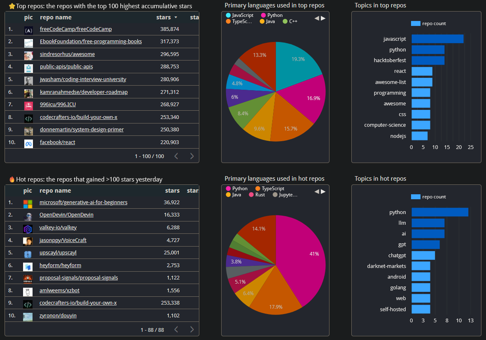
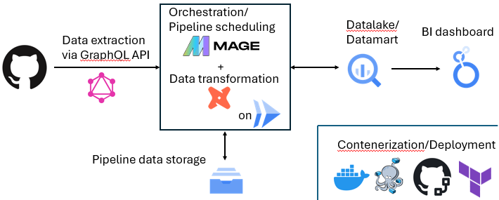

# GitHub Trend

GitHub is the platform where developers create, store and share the code. It is a popular website to host the open source software. Softwares are housed in the repositories. By tracking popular repositories, we can get to know the trend of software technology now. 

To catch the popular topics and languages in GitHub on a regular basis, I created this dashboard. This dashboard tracks two major types of popular repositories - ones that have the highest acccumulative number of stars, called **top repos**, and the other that acquired more than 100 stars at the day before the update of this dashboard, called **hot repos**. By knowing these two types of repositories, I expect to be able to grasp overall trend of software technology.

## Dashboard

[The link to running dashboard](https://lookerstudio.google.com/s/gtrvrMCNeI0)

[](https://lookerstudio.google.com/s/gtrvrMCNeI0)

## What questions does this dashboard address?

- What repositories are popular in GitHub now? 
- What languages are used in popular repositories? 
- What topics are common across popular repositories?


## Data Pipeline

This is the batch data pipeline. The data update is scheduled everyday until the creator's free GCP credit runs out.



### The flow of data pipeline:

#### Top repos
1. Obtain the list of the repositories that have the top 100 highest number of stars from GitHub using GraphQL API
2. On BigQuery, join the obtained data with GitHub Archive public data, that regularly retrieve the number of events (including star events) everyday
3. Display the data on Looker Studio dashboard

#### Hot repos
1. On BigQuery, get all the starring events yesterday from GitHub Archive public data, then make the list of repositories that obtained >100 stars yesterday
2. Using that list, obtain information that is not in the public data (e.g. image icon, the current number of stars etc) from GitHub API
3. Join all the data in BigQuery
4. Display the data on Looker Studio dashboard

## Replication

Firstly, clone this Git repository by:
```
git clone https://github.com/Tatz884/GitHub-Trend.git
```

Then run Docker Compose to install docker image and set up the container:
```
docker compose up
```

To edit the pipeline using Mage UI, open http:/localhost:6789/ after running the Docker container.

To obtain the data from GitHub API, you will also need the GitHub token.

To connect to data warehouse (BigQuery), you will also need the GCP service account key, necessary permissions, and store the secret in Google Cloud Secret Manager.

